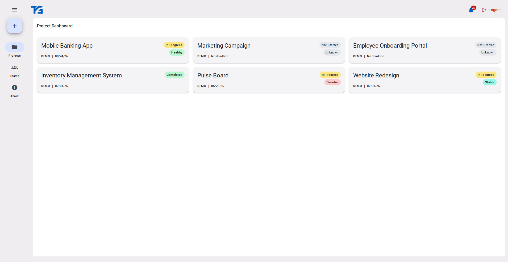
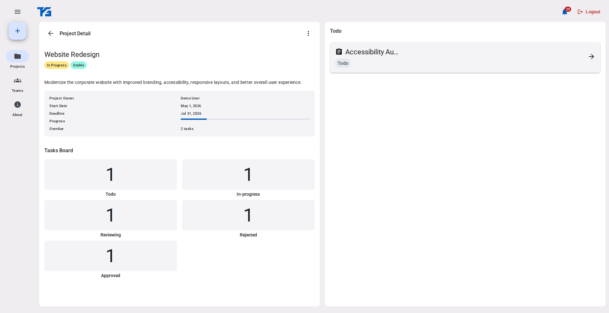
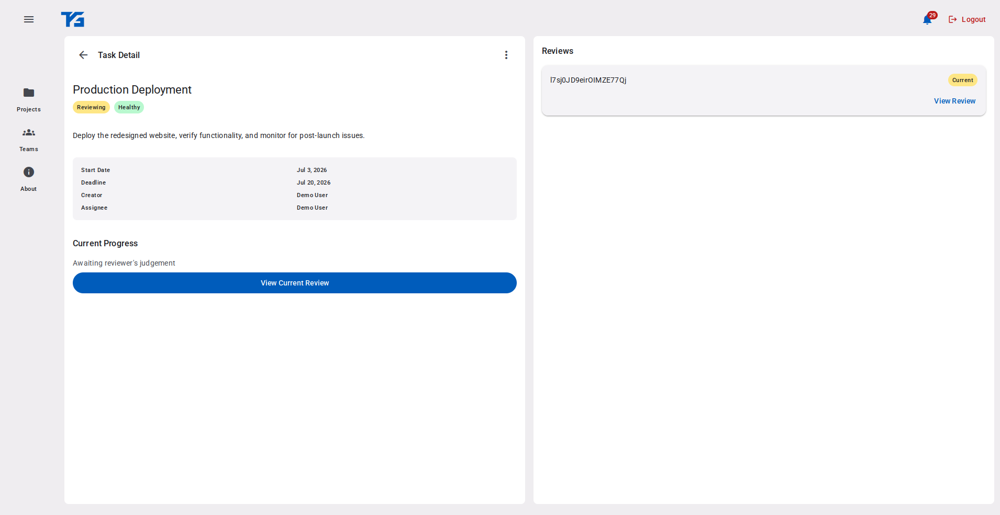
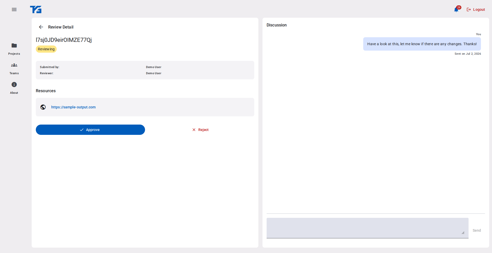
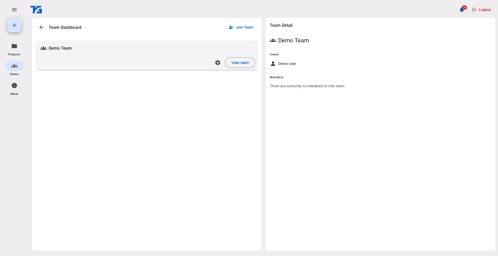

# Task Gate

Task Gate is a task management platform centered around structured submission workflows rather than simple task completion. Instead of marking work as complete, team members submit their output for review, where reviewers can approve, reject, and discuss revisions before work progresses. Combined with role-based permissions and real-time synchronization, this creates a collaborative workflow designed for teams that require explicit review and approval processes.

Built as a portfolio and engineering showcase project, Task Gate demonstrates modern frontend architecture, reactive data handling, scalable application design, and production deployment practices.

## Screenshots

### Project Dashboard


### Project Detail


### Task Detail


### Review Detail


### Team Dashboard


## Live Demo

[Live Website](https://taskgate.antipotion.com)

## Case Study

[Case Study](https://antipotion.com/task-gate)

## Why I Built TaskGate

Many task management tools focus on simple status tracking. Task Gate explores a workflow centered around explicit work submissions, review cycles, and permission-driven progression while serving as a playground for scalable Angular architecture.

---

# Tech Stack

## Frontend

- Angular 21+ (Upgraded to v22)
- TypeScript (Strict Mode)
- SCSS
- RxJS

## Backend

- Firebase

## Tooling

- Angular CLI
- npm
- ESLint
- Prettier

## Deployment

- Firebase

---

# Features

- Real-time progress updates
- Submission-based progression
- Team collaboration workflows
- Role-based access control for members, reviewers, and project owners
- Reactive data synchronization
- Notification system for assignment, submission events, and discussions
- Comment system

---

# Project Goals

This project was built to:

- Practice scalable frontend architecture
- Improve engineering workflow discipline
- Explore UI system consistency
- Simulate production-level application structure
- Serve as a public portfolio project for recruiters and collaborators
- Build an application from concept to MVP

---

# Installation

Clone the repository:

```bash
git clone https://github.com/antipotion/task-gate.git
```

Navigate into the project:

```bash
cd task-gate
```

Install dependencies:

```bash
npm install
```

Start the development server:

```bash
npm start
```

The application will usually run at:

```txt
http://localhost:4200
```

---

# Production Build

To generate a production build:

```bash
npm run build
```

Build artifacts will be generated inside the `dist/` directory.

---

# Folder Structure

```txt
src/
├── app/
│   ├── application/            // shared application services
│   ├── authentication/         // login and session management
│   ├── infrastructure/         // external infrastructures
│   ├── layout-shell/           // mobile and tablet layout shell
│   ├── notification/           
│   ├── project/                // core workflow and project domain
│   ├── team/                   // team management
└── environment/
```

> Folder structure may evolve as the project grows.

---

# Architectural Highlights

- Signal + RxJS interoperability
- Centralized domain modeling
- Strongly typed API contracts
- Scalable component composition
- Feature-first architecture
- Firebase adapter isolation
- Route-level lazy loading
- Strongly typed Firestore models
- Repository pattern
- Reactive state management
- Role-based workflow
- Responsive tablet+/mobile layouts
- Lazy loading

---

# Architecture Notes

The architecture intentionally prioritizes long-term maintainability, domain separation, and predictable state flow over short-term convenience.

The goal is not only functionality, but also coherence and maintainability as the application evolves.

---

# Current Limitations

Some features and refinements are still in progress, including:

- Built as a showcase project, with no production data-handling guarantee for commercial use

---

# Roadmap

Task Gate has reached its v1 milestone and is now considered feature-complete.

Future updates will primarily focus on maintenance, bug fixes, and incremental improvements rather than major feature additions.

---

# License

This project is licensed under the MIT License.

See the [LICENSE](./LICENSE) file for details.

---

# Author

**Antipotion**

- Portfolio: [https://antipotion.com](https://antipotion.com)
- GitHub: [https://github.com/antipotion](https://github.com/antipotion)

```
